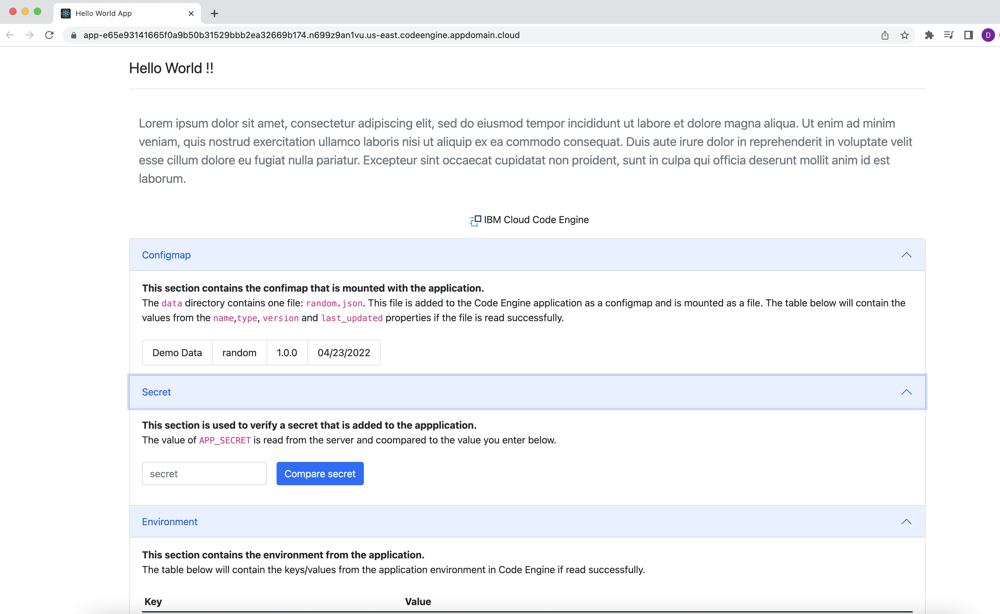
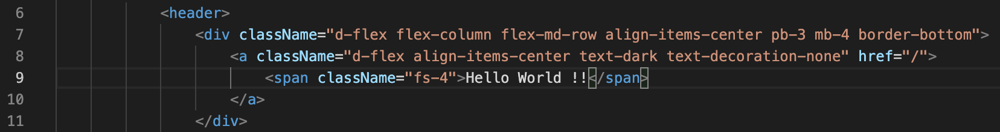
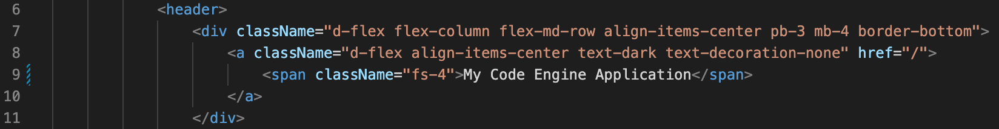

# Starter application for IBM Cloud Code Engine



This application is an example used to test deploying to IBM Cloud Code Engine using the following two GitHub Actions:

[Set up the IBM Cloud CLI](https://github.com/marketplace/actions/set-up-the-ibm-cloud-cli)

[Create, Update and Delete to IBM Cloud Code Engine](https://github.com/marketplace/actions/create-update-and-delete-to-ibm-cloud-code-engine)

### Before you begin

In order to follow the steps under getting started, you will need the following:

 - A GitHub username
 - An IBM Cloud account with **Pay-As-You-Go** plan.

### Getting started
In the image above, the header on the page is titled "Hello World", we will modify it to read something else and submit a pull request inside **your fork** of this repository. 


1. In the top-right corner of the page, click **Fork**. 

2. In **your fork**, go to **Settings** > **Secrets** > **Actions** and create a new repository secret:
    `API_KEY`: IBM Cloud API Key with the necessary permissions to create / delete Code Engine projects.

3. Clone **your fork** of this repository to your computer. 

    ```sh
      git clone https://github.com/YOUR-USERNAME/ce-starter-app
    ```

4. Create a new branch called `header-title`.

5. Navigate to the `webui/src` folder and using your favorite code editor, edit the `Header.tsx` file.

6. Modify line 9, from `Hello World!!` to `My Code Engine Application`.
  - From:
    

  - To:
    


7. Publish the branch to **your fork**.

8. Create a pull request comparing `main` to `header-title`

9. After submitting the pull request, the application will be built from source and deployed to Code Engine.  

10. Use the URL provided to validate the application changes. Once you are satisfied, merge and close the pull request.

11. Once the pull request is closed, the application will be deleted from Code Engine. 

### Manually deploy to Code Engine

1. Target your desired region.
  ```sh
    ibmcloud target -r us-east -g default
  ```

2. Create the Code Engine project.
  ```sh
    ibmcloud code-engine project create --name ce-starter-app
  ```

3. Create a configmap for the list of data centers (json file).
  ```sh
    ibmcloud code-engine configmap create \
    --name random.json \
    --from-file ./data/random.json 
  ```

4. Create the application from an existing container image, expose port 3001 and map the configmap to a volume. 
  ```sh
    ibmcloud code-engine app create -n ce-starter-app \
    --image <registry_host>/<registry_namespace>/ce-starter-app \
    --port 3001 \
    --mount-configmap /data=random.json
  ```

5. Optional - Update configmap 
  ```sh
    ibmcloud code-engine configmap update \
    --name random.json \
    --from-file ./data/random.json 
  ```

6. Optional - Update the application from an existing container image, expose port 3001 and map the configmap to a volume. 
  ```sh
    ibmcloud code-engine app update -n ce-starter-app \
    --image <registry_host>/<registry_namespace>/ce-starter-app \
    --port 3001 \
    --mount-configmap /data=random.json
  ```

### Build and run locally 

#### Build image
```sh
  docker build -t <registry_namespace>/ce-starter-app -f ./api/Dockerfile .
```

### Run local
```sh
  docker run --rm -v $(pwd)/data:/data -p 3001:3001 <registry_namespace>/ce-starter-app
```
